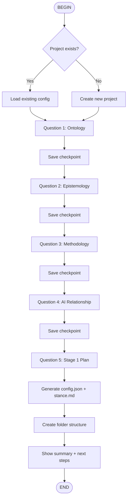

# qual-init: Project Initialization Flow

Flow skill for Socratic onboarding into Interpretive Orchestration.

## Flow Overview



## The 5 Questions

### Q1: Ontology — What is "data"?

**Question:** When you read research data, what are you encountering?

**Options:**
- A) Objective facts waiting to be discovered (Realist)
- B) Meanings requiring systematic interpretation (Interpretivist) ← Default
- C) Co-created realities with participants (Constructivist)
- D) Let me think about this

**Follow-up if D:** Socratic dialogue to help researcher decide.

### Q2: Epistemology — How do we know?

**Question:** How do you believe we can generate knowledge from qualitative data?

**Options:**
- A) Through rigorous objective analysis
- B) Through systematic interpretation balancing rigor and sensitivity ← Default
- C) Through co-construction with participants
- D) I'm not sure

### Q3: Methodology — Your tradition

**Question:** Which qualitative tradition resonates with your approach?

**Options:**
- A) Gioia & Corley Systematic Interpretivism ← Default
- B) Charmaz Constructivist Grounded Theory
- C) Classic Glaserian Grounded Theory
- D) Phenomenology
- E) Ethnography
- F) Other / Not sure

### Q4: AI Relationship

**Question:** How do you want AI to support your research?

**Options:**
- A) As a tool that automates tasks
- B) As a thinking partner that deepens my reflexivity ← Default
- C) I'm not sure what AI can offer

**Teaching moment:** Explain "calculator mindset" vs. "epistemic partnership"

### Q5: Stage 1 Planning

**Question:** How will you approach Stage 1 (manual foundation building)?

**Options:**
- A) Full plan — I'll code 10-15 documents before AI collaboration ← Recommended
- B) Minimum — I'll try 5 documents first
- C) I don't have time for manual coding

**Response if C:** Explain why this matters, offer minimum viable path.

## Savepoints

After each question, save checkpoint to `.interpretive-orchestration/checkpoint.json`:

```json
{
  "checkpoint_id": "q3_epistemology",
  "responses": {
    "q1": {"answer": "B", "elaboration": "..."},
    "q2": {"answer": "B", "elaboration": "..."},
    "q3": {"answer": "A", "elaboration": "..."}
  },
  "timestamp": "2026-01-15T10:30:00Z"
}
```

## Generated Files

### config.json
Machine-readable configuration based on responses.

### epistemic-stance.md
Human-readable philosophical statement.

### README.md
Project documentation with quick start.

## Usage

```bash
/flow:qual-init                    # Start onboarding
/flow:qual-init --resume           # Resume from checkpoint
/flow:qual-init --reconfigure      # Re-run with existing config
```

## Next Steps After Flow

After completion, researcher should:
1. Review `epistemic-stance.md`
2. Begin Stage 1 manual coding
3. Use `@stage1-listener` for thinking partnership
4. Complete 10-15 documents before Stage 2

**Note:** `@stage1-listener` routing works when you run Kimi with:
```bash
kimi --agent-file .agents/agents/interpretive-orchestrator.yaml
```

---

*Part of Interpretive Orchestration for Kimi CLI*
