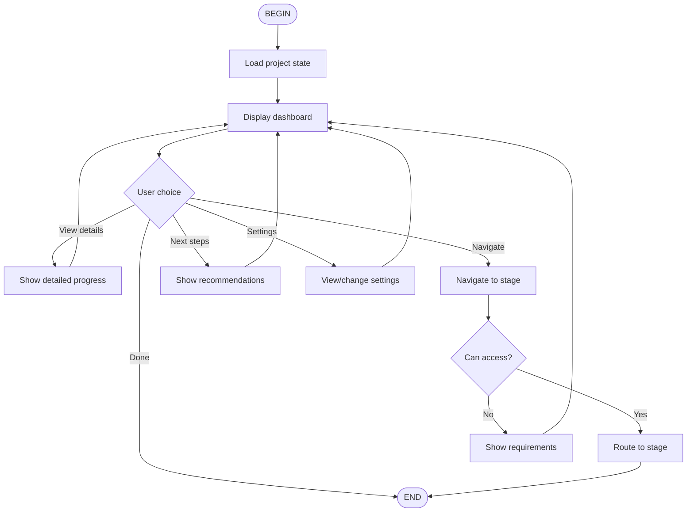

# qual-status: Progress Dashboard

Flow skill for visualizing progress and navigating the atelier.

## Flow Overview



## Dashboard Display

### Visual Progress

```
╔══════════════════════════════════════════════════════════════╗
║        INTERPRETIVE ORCHESTRATION: PROGRESS                  ║
╚══════════════════════════════════════════════════════════════╝

┌─ ATELIER STATUS ─────────────────────────────────────────────┐
│                                                              │
│  🔓 Stage 1: Foundation                ← You are here        │
│     └── 7/10 documents manually coded (70%)                  │
│                                                              │
│  🔒 Stage 2: Collaboration         [Complete Stage 1]        │
│  🔒 Stage 3: Synthesis             [Complete Stage 2]        │
│                                                              │
└──────────────────────────────────────────────────────────────┘

┌─ PROGRESS METRICS ───────────────────────────────────────────┐
│                                                              │
│  📄 Documents: 7 manually coded | 0 AI-assisted              │
│  📝 Memos: 3 written                                         │
│  🏷️  Codes: 12 created                                       │
│  📊 Saturation: Emerging (new codes slowing)                 │
│                                                              │
│  Last activity: 2 hours ago                                  │
│  Session time: 45 minutes                                    │
│                                                              │
└──────────────────────────────────────────────────────────────┘

┌─ NEXT STEPS ─────────────────────────────────────────────────┐
│                                                              │
│  1. Continue manual coding (3 more documents)                │
│  2. Write analytical memo on emerging patterns               │
│  3. Review and refine your initial framework                 │
│                                                              │
│  🎯 Goal: Complete Stage 1 to unlock AI collaboration        │
│                                                              │
└──────────────────────────────────────────────────────────────┘

[Continue working] [View full details] [Change settings]
```

## By Stage

### Stage 1 Display

```
┌─ STAGE 1: FOUNDATION ────────────────────────────────────────┐
│                                                              │
│  Progress: ████████████████░░░░░░░░░  70%                    │
│                                                              │
│  Requirements to complete:                                   │
│  ✅ Manual coding: 7/10 documents                            │
│  ⏳ Analytical memos: 3/5 recommended                        │
│  ⏳ Framework: Emerging                                      │
│                                                              │
│  Estimated time to Stage 2: ~3 hours                         │
│                                                              │
│  [Continue coding] [Write memo] [View framework]             │
└──────────────────────────────────────────────────────────────┘
```

### Stage 2 Display

```
┌─ STAGE 2: COLLABORATION ─────────────────────────────────────┐
│                                                              │
│  🌊 Stream A (Theoretical): Active                           │
│     └── Literature integration in progress                   │
│                                                              │
│  🌊 Stream B (Empirical): Active                             │
│     └── 45/100 documents coded (45%)                         │
│                                                              │
│  🔄 Last sync: 2 hours ago                                   │
│  📅 Next sync point: After 50 documents                      │
│                                                              │
│  [View Stream A] [View Stream B] [Synthesize]                │
└──────────────────────────────────────────────────────────────┘
```

### Stage 3 Display

```
┌─ STAGE 3: SYNTHESIS ─────────────────────────────────────────┐
│                                                              │
│  📝 Manuscript: Drafting                                     │
│     └── Introduction: Complete                               │
│     └── Literature Review: In progress                       │
│     └── Findings: Outlined                                   │
│     └── Discussion: Not started                              │
│                                                              │
│  💬 Scholarly companion sessions: 3                          │
│  🎯 Theoretical contribution: Articulating                   │
│                                                              │
│  [Continue writing] [Ask companion] [Review evidence]        │
└──────────────────────────────────────────────────────────────┘
```

## Navigation

### Stage Transitions

When user requests to move to a different stage:

1. **Check requirements** — Can they access requested stage?
2. **If YES** — Route to appropriate flow/skill
3. **If NO** — Show what's needed

```
User: "Go to Stage 2"

System: "Stage 2 requires:
        ✅ Manual coding: 10/10 documents
        ❌ Analytical memos: 2/5 recommended
        
        You can proceed, but we recommend completing
        at least 3 memos first for better theoretical foundation.
        
        [Proceed anyway] [Complete memos first]"
```

## Commands

```bash
/flow:qual-status              # Show dashboard
/flow:qual-status --details    # Show full details
/flow:qual-status --stage 2    # Jump to stage 2 view
/flow:qual-status --next       # Show next steps only
```

## Integration

Uses:
- `StateManager` — Load current state
- `DefensiveSkillRouter` — Check stage access
- Progress calculation from config

---

*Part of Interpretive Orchestration for Kimi CLI*
